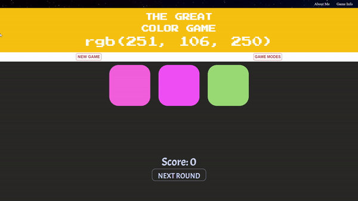

# Color Game

> A game of guessing color code.

A working example is hosted at: [Color Game](https://hack-over-flow-assignment1.vercel.app/)
A game not of just guess.
A Color Game is a basic game on guessing the color code of given color tile. This game is uses HTML, CSS and JS.4

---
# ENJOY THE GAME
#PLAY WITH YOUR FINGERS
This game has both easy mode as well as hard mode.. Try this !!
